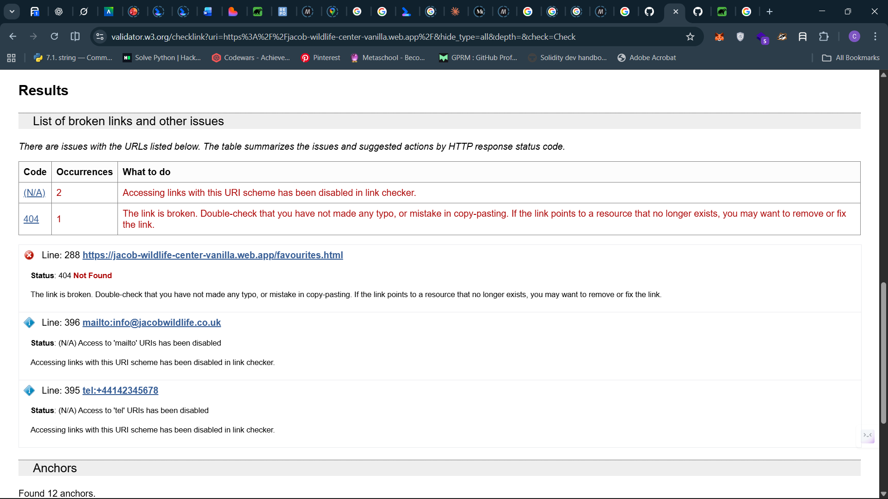
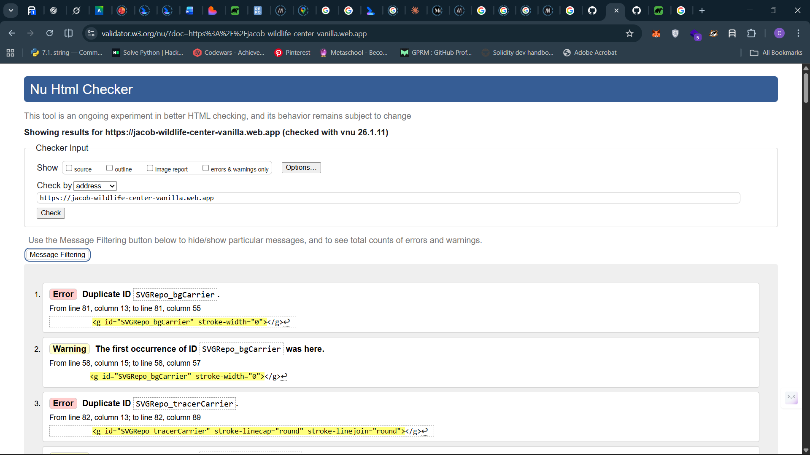
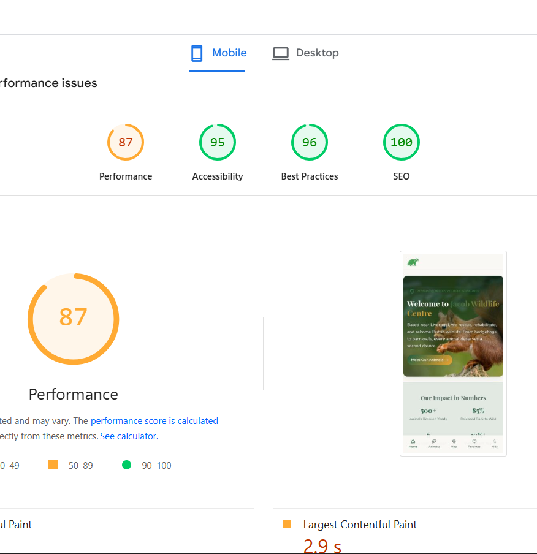
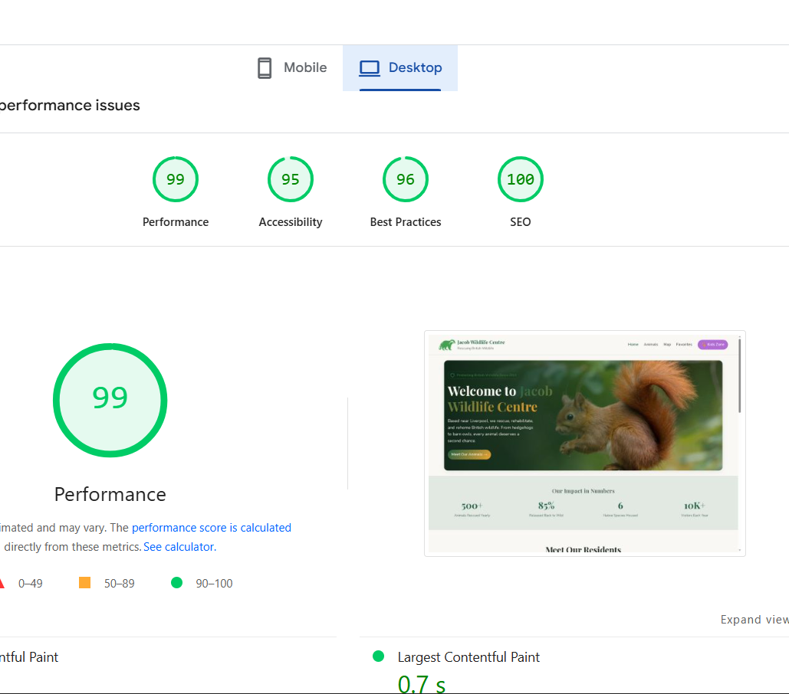

Staring my application up on the 18th of December, 2025, during CMWA class ( I said i would complete this project before the end of november🥲).
 created folder structure and created index.html and data/animals.json, css/style.css and js/index.js.

 used ai to generate demo json data and added it to data/animals.json   ```json[
  {
    "id": "badger",
    "name": "European Badger",
    "sci": "Meles meles",
    "desc": "Nocturnal diggers that live in family groups called clans. They help control pest populations.",
    "img": "assets/badger.jpg",
    "lat": 53.3500,
    "lng": -2.9000,
    "tips": ["Leave a shallow dish of water in your garden", "Don't disturb setts (their homes)", "Put out unsalted peanuts"]
  },
  // other json```. I updated it with more fields and improved the content of the description and tips.

downloaded images from wikipedia, heartofengland.org and wildlifetrusts.org

converted european_otter.png to webp (631kb to 90.42kb), european_hedgehog.png to webp (5.6mb to 783.07kb) and european_badger.png to webp (257.17 KB to 35.91 KB) using freeconvert.com // specify why you did it and what are the benefits

downloaded badger silhouette from vecteezy and removed background using removebg.com and added a green color background
converted it to favicon and added it to assets folder using realfavicongenerator.net


choice of color, since we are building something forest-y and green is the color of nature. i thought of zoo, animal rescue, reserve, and the national geographic scene came to mind, so i did a lil search online on color  for an animal rescue zoo and colors aside the brands'color were colors that invoke  trust, calmness, health, and warmth. with h blue and green being the most common. and using websites like https://produkto.io/color-palettes/ and https://colorhunt.co/ where you can search for various color themes and palette based on maybe your prompt or designed branding. it also uses ai to suggest colors. #2D6A4F, #40916C, #264E35, #D9F2E9, #D69E2E, #F4C259, #8B6F3F, #FEF7E0

I contemplated whether or not to use icons as to not go against the guidelines of the application and i discovered the use of svg pasted in the code is fine. as that is reliant on the browser and its html only but downloading font awesome icons aor any other icon package through npm is not, getting cdn links and adding to the header may also be seen as a violation of the guidelines.

my icons are gotten from svgrepo.com. when trying to style the svg icons i had trouble changing their color and stroke through css and it was quite a hassle to debug, copying the same svg over and over too , made my html cluttered and did not following the DRY principle, thus why an icon package/library would be better to use.i later achieved or got my desired result by passing the currentColor variable to the stroke attribute.

I initially used fixed padding but refactored to a dynamic solution based on the actual header height. because hardcoded values broke on tablet screen sizes. I noticed that this my approach `const header = document.getElementById("header");
document.documentElement.style.setProperty(
  "--header-height",
  `${header.offsetHeight}px`
);
console.log("Header height set to:", header.offsetHeight);
const mobileNav = document.getElementById("mobileNav");
document.documentElement.style.setProperty(
  "--mobile-nav-height",
  `${mobileNav.offsetHeight}px`
);
console.log("Mobile nav height set to:", mobileNav.offsetHeight);` returned 0 in some cases when the screen resoultion was changed this defeating hte whole process and rendering inconsistently. so i have to add a default value incase if 0 or no value is returned
```

```
## Navigation visibility issue (Responsive Design)
Initial header wrapped on tablets; thought of the best way to make it responsive around the 768-960px breakpoints so I tried reducing logo, this distorted branding, i decided to remove logo subtitle as this message was already being conveyed at the hero section and footer,I also reduced gap size between nav items, thus giving the header more breathable room and improving the ui.

While working on the responsive navigation, I wanted the Kids Zone link to remain visible on smaller screens, while the rest of the navigation items would be hidden and later moved to the footer. On larger screens (768px and above), all navigation items should be visible again.

Initially, I hid the entire navigation container using display: none and attempted to make the Kids Zone item visible again using a media query. However, this approach did not work as expected. I realised that when a parent element is set to display: none, all of its child elements are removed from the layout and cannot be shown individually.

After reflecting on this, I changed my approach to keep the navigation container visible at all screen sizes and instead control the visibility of individual navigation items. By hiding all list items by default and then selectively displaying the Kids Zone link on smaller screens, I was able to achieve the desired behaviour. A media query was then used to display all navigation items again on larger screens.

## Dynamic layout values using JavaScript

To prevent the fixed header and mobile navigation from overlapping page content, I experimented with a dynamic approach using JavaScript to calculate their heights and store the values in CSS custom properties. This allowed me to apply padding and margins based on the actual rendered height of these elements rather than relying on hard-coded values.

While this approach worked on initial page load, I noticed several limitations. The JavaScript only runs once when the page loads, meaning it does not automatically recalculate values when the viewport size changes. As a result, when elements such as the mobile navigation are hidden at larger screen sizes, their offsetHeight returns 0. If the viewport is later resized without a full page refresh, the stored CSS values are no longer accurate, leading to missing spacing or visual misalignment.

I also observed that small layout shifts, such as font loading or breakpoint changes, could cause the header padding to feel inconsistent, as the JavaScript does not re-run to account for these changes.

This highlighted an important limitation of this approach in a vanilla JavaScript context and helped me understand why modern frameworks like React provide lifecycle hooks to react to layout changes more reliably. For this project, I chose to keep the solution simple and accept these trade-offs, as the dynamic calculation still improved maintainability compared to fully hard-coded spacing values.


### code repetition and lack of consistency with the DRY principle, i.e. Don't Repeat Yourself.

while building ou other pages of the app like the animals and maps and events pages, i realised i had to copy over a lot of boilerplate code and constant components like the header and footer, the mobile navigation and the svg icons, that is one downside of vanilla app development and one major problem that react solves ( and next that is on-top of react). if to say i was building with next,i realized i can easily create reusable components that can be used across multiple pages, thus saving a lot of boilerplate code and making the codebase more maintainable and consistent with the DRY principle.

### Navigation state, ARIA, and styling

I initially thought that I would need JavaScript to manage active navigation styling, assuming that aria-current="page" was only for accessibility and could not drive visual feedback. On further investigation, I realised that while aria-current does not update automatically, it can still be used as the source of truth for both accessibility and styling through CSS attribute selectors.

In a static multi-page site, navigation state is page-based rather than dynamic. Each HTML file declares which link represents the current page. This allows aria-current="page" to communicate the correct state to assistive technologies, while CSS handles the visual highlighting without additional JavaScript.

JavaScript-based class toggling is only necessary when navigation state needs to update dynamically without a page reload, such as in SPAs or shared layouts. For this project, a declarative, page-level approach is simpler, more maintainable, and aligns better with accessibility best practices.

when styling the navigation, the accent favorites button, I discovered that a scale transform applied to a navigation link was not taking effect even though the CSS selector was correct. The issue was that anchor elements are inline by default and do not reliably support transforms. Changing the link to display: inline-flex created a proper layout box, allowing the transform to apply as expected. This highlighted the importance of understanding how display types affect CSS rendering behaviour. Mozilla Developer Network (MDN) (n.d.) CSS display. Available at: https://developer.mozilla.org/en-US/docs/Web/CSS/display (Accessed: 27 December 2025).
Mozilla Developer Network (MDN) (n.d.) CSS transform. Available at: https://developer.mozilla.org/en-US/docs/Web/CSS/transform (Accessed: 27 December 2025). Mozilla Developer Network (MDN) (n.d.) Inline formatting context. Available at: https://developer.mozilla.org/en-US/docs/Web/CSS/Inline_formatting_context
 (Accessed: 27 December 2025).

 red deer and fox image gotten from woodland trust.

 date: 2026-01-10
 when creating the animal card, A single inline SVG icon was used for the favourites feature, with visual state changes controlled via CSS and ARIA attributes. This avoided duplication, improved accessibility, and ensured consistent styling across interaction states.

 While implementing the “Add to Favourites” feature on the animal cards, I encountered an unexpected issue with styling SVG icons dynamically, particularly when supporting light and dark colour schemes.

My goal was to use a single heart SVG icon and change its appearance based on whether an animal had been favourited:

Outline only when inactive

Filled and highlighted (gold accent colour) when active

Initially, the fill colour updated correctly, but the stroke colour refused to change, especially in dark mode. The stroke remained black in light mode and whitesmoke in dark mode, regardless of the CSS rules applied.

After investigating further, I discovered that the problem was not with my CSS, but with the SVG markup itself. The <path> element inside the SVG had an inline stroke attribute defined directly in the SVG file. Because inline SVG attributes have a higher priority than CSS, this hard-coded value was overriding my stylesheet rules.

Once I removed the inline stroke attribute from the SVG and allowed the stroke to be controlled entirely via CSS using currentColor, the issue was resolved. This enabled the icon to automatically inherit the colour of its parent element and respond correctly to state changes and colour schemes.

This solution allowed me to:

Use one SVG instead of two

Keep the UI consistent across light and dark modes

Apply state-based styling cleanly using CSS classes

Improve accessibility and maintainability

The rendering logic was separated from the DOM event handlers, allowing the same function to render both the full dataset and filtered results based on user input. This improved maintainability and mirrored component-based rendering approaches used in modern frameworks.

## Development Diary – Favorites Page State Management

While implementing the Favorites page, I encountered a challenge with keeping the UI in sync when the favorites state changed. Unlike React, where state changes automatically trigger re-renders via hooks such as useEffect, a vanilla JavaScript application requires a more manual approach.

Initially, changes to favorites (toggling an animal or clearing all favorites) required a page refresh to reflect the updated state. I explored the `storage` event described in MDN documentation (MDN Web Docs, n.d.-c), but discovered that it does not fire within the same browser context that modifies localStorage, making it unsuitable for this use case.

To solve this, I implemented a custom event-based approach. Whenever a favorite was added or removed, a CustomEvent (favoriteUpdated)(MDN Web Docs, n.d.-a) was dispatched on the window object. The Favorites page listens for this event and re-renders the UI accordingly. This allowed the page to respond instantly to state changes without a reload.

I separated responsibilities by using an initialisation function (initFavoritesPage) to set up the page, event listeners, and initial render, while a dedicated render function (renderFavorites) handled UI updates. This separation improved maintainability and mirrors reactive patterns used in modern JavaScript frameworks.

This approach ensured the Favorites page remained responsive, efficient, and aligned with modern web development principles while staying within the constraints of vanilla JavaScript.
MDN Web Docs (n.d.-c) Window: storage event. Available at: https://developer.mozilla.org/en-US/docs/Web/API/Window/storage_event
 (Accessed: 10 January 2026).
 MDN Web Docs (n.d.-b) EventTarget.dispatchEvent(). Available at: https://developer.mozilla.org/en-US/docs/Web/API/EventTarget/dispatchEvent
 (Accessed: 10 January 2026).
 MDN Web Docs (n.d.-a) CustomEvent. Available at: https://developer.mozilla.org/en-US/docs/Web/API/CustomEvent
 (Accessed: 10 January 2026).

 ## Development Reflection – Page Routing and Module Execution

During the implementation of page-based routing for the application, I encountered an issue where no content rendered when navigating between pages, despite the routing logic being correctly defined. Initially, I wrapped the routing logic inside a `DOMContentLoaded` event listener, assuming it was necessary to ensure the DOM was fully loaded before execution.

However, the application’s JavaScript was loaded using ES modules (`type="module"`), which are deferred by default. Additionally, the module made use of top-level `await` to fetch animal data before initialising any page logic. This introduced an important execution order detail: while the module execution was paused waiting for the data fetch to resolve, the `DOMContentLoaded` event had already fired. As a result, the event listener was registered too late and never executed, causing the routing logic to be skipped entirely.

Once the `DOMContentLoaded` wrapper was removed, the routing logic executed immediately after the module resumed, at a point where the DOM was already parsed and the required data was available. This resolved the issue and allowed each page’s initialisation function to run as expected.

This experience improved my understanding of how ES modules differ from traditional scripts, particularly how module deferral and top-level `await` affect execution timing. It reinforced the importance of understanding the JavaScript runtime model rather than applying patterns such as `DOMContentLoaded` indiscriminately.

The `aspect-ratio` property was used to maintain consistent card layouts and prevent layout shifts while images load. This ensures a stable, responsive UI without relying on fixed heights or JavaScript calculations.”

used AI to generate tips and funfacts about the animals cite https://openai.com/chatgpt


I forgot to account for the install button during earlier development, so i was torn on where to include it, having that it has to persist through all pages, and my current nav looks good as-is. i thought of many approaches, like making it a floating button, making it a dismissable banner, or adding it to the footer. and after reading this article from web.dev `https://web.dev/articles/promote-install` i went with reorganizing my footer and adding it as banners and floating buttons may be intrusive or obtrusive to the user experience.

I found out that  by a web search means ``In web development, art-directed responsive images refers to the technique of intentionally displaying entirely different images (or different crops/aspect ratios of the same image) based on the user's device characteristics, such as screen size or orientation. 
This goes beyond standard responsive images, which merely serve different sizes of the same image to optimize performance (e.g., a smaller file for a mobile device).  that prompted me to wrap my images in a `picture` tag and to provide image variants for various screen sizes.

I implemented service workers and caching( didn't know that you needed a service worker for your pwa to work/install button to show). https://web.dev/learn/pwa/service-workers
https://medium.com/paypal-tech/intro-to-javascript-service-workers-43298c365549

Date: 11 January 2026

Objective:
Integrate Google Maps to display the user’s location and multiple animal locations using markers, in line with the assessment specification.

Summary:
I integrated the Google Maps JavaScript API into the initMapsPage() flow to render an interactive map showing the user’s location and optional animal markers. The user’s location is displayed by default using a red pin, while animal locations can be toggled on to avoid clutter and improve usability.

Key Decisions:

Kept all map logic inside initMapsPage() to maintain access to animal data, user location state, and UI controls.

Used a toggle to show/hide animal markers, allowing the map to focus on the user initially and display all markers only when required.

Used fitBounds() when animal markers are shown so the map automatically adjusts to display both the user and animals.

Issues Encountered & Solutions:

Encountered InvalidValueError due to mismatched coordinate properties (latitude/longitude vs lat/lng). Fixed by aligning marker creation with the JSON data structure.

Prevented API errors by ensuring all coordinates were numeric using Number().

Confirmed that the map’s initial centre can remain static in HTML, as dynamic centring is handled in JavaScript.

Implementation Outcome:

User location is displayed by default with a red marker.

Animal locations are added dynamically from JSON data.

Map recentres intelligently based on visible markers.

Clean marker management using arrays to avoid duplication or memory issues.

https://developers.google.com/maps/documentation/javascript/adding-a-google-map?_gl=1*rg5w20*_up*MQ..*_ga*MzQ0NjkzNC4xNzY4MTQ1MDQz*_ga_SM8HXJ53K2*czE3NjgxNDUwNjgkbzEkZzAkdDE3NjgxNDUwNjgkajYwJGwwJGgw*_ga_NRWSTWS78N*czE3NjgxNDUwNDMkbzEkZzAkdDE3NjgxNDUwNjkkajM0JGwwJGgw


# Development Log - Jacob Wildlife Explorer App

**Project:** Jacob Wildlife Centre Mobile Web Application  
**Developer:** Chidube Anike  
**Duration:** January 2026  
**Technologies:** HTML5, CSS3, JavaScript (ES6+), Google Maps API, PWA

---

## Log Entry 1: Google Maps Integration with Animal Markers

**Date:** January 11, 2026  
**Feature:** Interactive map displaying animal locations and user geolocation

### Initial Challenge
I needed to integrate Google Maps API to show both animal locations as markers and the user's current location. The specification required showing "a map of all the different animals at the centre and the user's location."

### Implementation Approach
Started by examining Google's Maps JavaScript API documentation (Google, 2025a). The demo code used `AdvancedMarkerElement` which seemed like the right approach for custom markers. My initial confusion was whether to place the `initMap()` function inside or outside my existing `initMapsPage()` function.

### Technical Decisions
**Decision 1: Function Structure**  
Decided to merge `initMap()` into `initMapsPage()` because:
- The map initialization needed access to animal data
- User location state was managed in `initMapsPage()`
- Better encapsulation of all map-related logic

**Decision 2: Toggle Mechanism**  
The spec was ambiguous about showing animals and user location simultaneously. I implemented a toggle pattern where:
- Default view: User location only (centered, zoom level 15)
- Toggle ON: All animal markers + user location with auto-fit bounds
- This felt more intuitive than overwhelming users with all markers immediately

### Bugs Encountered
**Bug 1: Invalid Coordinate Errors**
```
InvalidValueError: not a LatLng or LatLngLiteral: in property lat: not a number
```

**Root Cause:** My code accessed `animal.location.latitude` but my JSON used `lat` and `lng` as property names. Simple mismatch but took time to spot.

**Solution:** Updated all coordinate access to match JSON structure:
```javascript
// Changed from
lat: animal.location.latitude
// To
lat: animal.location.lat
```

**Bug 2: Duplicate User Markers**  
When refreshing location, new markers were created without removing old ones.

**Solution:** Implemented cleanup before creating new markers:
```javascript
if (userMarker) {
  userMarker.map = null; // Remove old marker
}
```

### Coordinates Verification
Had to verify Liverpool coordinates for animals. Used Google Maps to get Liverpool city center (53.4084, -2.9916) and placed animals within reasonable bounds (53.33-53.42 lat, -2.85 to -3.05 lng). Some animals ended up slightly outside Liverpool proper (like the deer at 53.33), but close enough for the zoo context.

### Key Learning
The `fitBounds()` method (Google, 2025b) automatically calculates optimal zoom and center to show all markers. Much better than manual calculations. Also learned that `LatLngBounds` works by extending a bounding box to include each coordinate - elegant solution.

**References:**
- Google. (2025a) *Advanced Markers*. Available at: https://developers.google.com/maps/documentation/javascript/advanced-markers/overview (Accessed: 11 January 2026).
- Google. (2025b) *Fit Bounds*. Available at: https://developers.google.com/maps/documentation/javascript/reference/map#Map.fitBounds (Accessed: 11 January 2026).

---

## Log Entry 2: Progressive Web App (PWA) Implementation

**Date:** January 11, 2026  
**Feature:** PWA functionality including offline support, installability, and app manifest

### Understanding PWA Requirements
The specification required PWA implementation with manifest, viewport, theme colors, and mobile capabilities. Started by reviewing web.dev's PWA documentation (Google, n.d.a) to understand core requirements.

### Web Manifest Configuration
Created `site.webmanifest` with required properties. Initially had only `maskable` icons, but learned from MDN (Mozilla, 2024a) that I needed both `"purpose": "any"` and `"purpose": "maskable"` versions for proper display across devices.

**Initial mistake:** Set `background_color` same as `theme_color` (both green). Realized the background should be neutral for better loading experience.

### Service Worker Implementation
This was conceptually challenging at first. The service worker acts as a proxy between the app and network (Mozilla, 2024b). Three main lifecycle events:

1. **Install:** Cache critical resources
2. **Activate:** Clean up old caches
3. **Fetch:** Serve from cache, fallback to network

**Challenge:** Understanding why `e.preventDefault()` in `beforeinstallprompt` showed console warnings.

**Resolution:** Learned this is expected behavior - we're preventing the browser's default install banner to show our custom UI instead (Google, n.d.b). The console message "Banner not shown: beforeinstallprompt.preventDefault() called" is actually confirmation it's working correctly.

### Install Button Implementation
Implemented install button following Google's promote install patterns (Google, n.d.c). Key decisions:

**Mobile:** Icon-only button (📲) in header to save space  
**Desktop/Tablet:** Full button with text "Install"  
**Kids Page:** Promotional card with kid-friendly language

Used `deferredPrompt` pattern to control when install dialog appears (Google, n.d.b).

### Light/Dark Mode
Implemented using CSS custom properties with `prefers-color-scheme` media query (MDN, Mozilla, 2024c):

```css
:root {
  --color-background: #ffffff;
  --color-text: #2c3e50;
}

@media (prefers-color-scheme: dark) {
  :root {
    --color-background: #1a1a1a;
    --color-text: #f0f0f0;
  }
}
```

This automatically switches based on device settings. Added transition for smooth mode changes.

### Network Information API
Implemented network connectivity detection using the Network Information API (MDN, Mozilla, 2024d). Shows connection type (4G, 3G, etc.) and warns users on slow connections. This helps users understand why content might load slowly. the `navigator.connection`  has limited support. whereas `navigator.onLine` is baselined.

### Testing Issues
**iOS Limitation:** Safari doesn't support `beforeinstallprompt` event (Apple doesn't implement this Web API). Install button won't show on iOS - users must manually use Share → Add to Home Screen. This is a known limitation documented by web.dev (Google, n.d.b).

**Solution:** Could add iOS-specific instructions, but decided to keep it simple since the manifest still works for manual installation.

**References:**
- Google. (n.d.a) *What are Progressive Web Apps?* Available at: https://web.dev/what-are-pwas/ (Accessed: 11 January 2026).
- Google. (n.d.b) *How to provide your own in-app install experience*. Available at: https://web.dev/customize-install/ (Accessed: 11 January 2026).
- Google. (n.d.c) *Patterns for promoting PWA installation*. Available at: https://web.dev/promote-install/ (Accessed: 11 January 2026).
- Mozilla. (2024a) *Web app manifests*. Available at: https://developer.mozilla.org/en-US/docs/Web/Manifest (Accessed: 11 January 2026).
- Mozilla. (2024b) *Service Worker API*. Available at: https://developer.mozilla.org/en-US/docs/Web/API/Service_Worker_API (Accessed: 11 January 2026).
- Mozilla. (2024c) *prefers-color-scheme*. Available at: https://developer.mozilla.org/en-US/docs/Web/CSS/@media/prefers-color-scheme (Accessed: 11 January 2026).
- Mozilla. (2024d) *Network Information API*. Available at: https://developer.mozilla.org/en-US/docs/Web/API/Network_Information_API (Accessed: 11 January 2026).

---

## Log Entry 3: Responsive Images with Art Direction

**Date:** January 11, 2026  
**Feature:** Art-directed responsive images using `<picture>` element

### The Challenge
Specification required "suitable optimised art-directed images." I was dynamically generating animal cards from JSON data, so implementing `<picture>` elements wasn't straightforward.

### Understanding Art Direction
Read MDN's guide on responsive images (Mozilla, 2024e). The difference between:
- **Resolution switching:** Same image, different sizes
- **Art direction:** Different crops/compositions for different viewports

Decided to use art direction approach - mobile could show tighter crops of animals' faces, desktop could show more environment.

### JSON Structure Design
Extended animal objects with separate image properties:
```json
{
  "img": "european_badger.webp",          // Fallback
  "imgMobile": "european_badger_mobile.webp",
  "imgDesktop": "european_badger_desktop.webp"
}
```

This maintains backwards compatibility - if `imgMobile`/`imgDesktop` don't exist, falls back to `img`.

### Dynamic `<picture>` Generation
Modified `createAnimalCard()` function to conditionally generate `<picture>` elements:

```javascript
const hasPictureSupport = animal.imgMobile && animal.imgDesktop;

const imageHTML = hasPictureSupport ? `
  <picture>
    <source media="(max-width: 600px)" srcset="${animal.imgMobile}">
    <source media="(min-width: 601px)" srcset="${animal.imgDesktop}">
    
  </picture>
` : `
  
`;
```

### Progressive Enhancement Strategy
Don't have optimized versions for all images yet. The approach allows me to:
1. Add optimized images gradually
2. System automatically uses them when available
3. Falls back gracefully if not present

### Performance Considerations
According to web.dev (Google, n.d.d), art-directed images should:
- Mobile: 400-600px wide, < 100KB
- Desktop: 800-1200px wide, < 300KB

Haven't created all optimized versions yet, but the structure is ready. Can use tools like Squoosh (Google, n.d.e) to optimize later.

### Key Learning
The `<picture>` element's media queries are evaluated before the image loads, so the browser only downloads the appropriate version (Mozilla, 2024e). This is different from CSS responsive images where all versions might be downloaded.

**References:**
- Google. (n.d.d) *Fast load times*. Available at: https://web.dev/fast/ (Accessed: 11 January 2026).
- Google. (n.d.e) *Squoosh*. Available at: https://squoosh.app (Accessed: 11 January 2026).
- Mozilla. (2024e) *Responsive images*. Available at: https://developer.mozilla.org/en-US/docs/Learn/HTML/Multimedia_and_embedding/Responsive_images (Accessed: 11 January 2026).

---

## Log Entry 4: Geolocation API Integration

**Date:** January 11, 2026  
**Feature:** User location detection with error handling

### Implementation
Used the Geolocation API (Mozilla, 2024f) to get user's current position. Implemented with proper error handling for permission denials and timeouts.

### Error Handling Strategy
The API can fail for multiple reasons (Mozilla, 2024f):
- PERMISSION_DENIED: User blocked location access
- POSITION_UNAVAILABLE: GPS/network location failed
- TIMEOUT: Request took too long

Implemented specific error messages for each case to help users understand what went wrong.

### Configuration Options
Used these options for better accuracy:
```javascript
{
  enableHighAccuracy: true,  // Use GPS if available
  timeout: 15000,            // 15 second timeout
  maximumAge: 0              // Don't use cached position
}
```

The `enableHighAccuracy: true` option requests GPS data which is more accurate but uses more battery (Mozilla, 2024f). Acceptable trade-off for this use case.

### Privacy Considerations
Geolocation requires user permission (W3C, 2022). The browser shows a permission prompt automatically. I display the accuracy radius to be transparent about location precision.

### Integration with Maps
Stored location as `{ lat, lng, accuracy }` object. The accuracy value shows users how precise their location is (±Xm radius). This helped integrate smoothly with Google Maps which expects `{lat, lng}` objects.

**References:**
- Mozilla. (2024f) *Geolocation API*. Available at: https://developer.mozilla.org/en-US/docs/Web/API/Geolocation_API (Accessed: 11 January 2026).
- W3C. (2022) *Geolocation API Specification*. Available at: https://www.w3.org/TR/geolocation/ (Accessed: 11 January 2026).

---

## Log Entry 5: Navigation and Responsive Design

**Date:** January 11, 2026  
**Feature:** Responsive navigation with mobile bottom bar and desktop header

### Design Pattern
Implemented split navigation pattern:
- **Desktop (≥768px):** Header navigation with all links
- **Mobile (<768px):** Bottom navigation bar with icons

This follows mobile UX best practices (Nielsen Norman Group, 2016) - bottom navigation is easier to reach with thumbs.

### CSS Media Query Organization
Used mobile-first approach:
```css
/* Mobile default */
.mobile-nav { display: flex; }
.nav__item { display: none; }

/* Tablet and up */
@media (min-width: 768px) {
  .mobile-nav { display: none; }
  .nav__item { display: block; }
}
```

### Install Button Positioning Challenge
**Problem:** Kids Zone button showed in header on mobile even though I moved it to footer nav.

**Cause:** CSS rule `.nav__kids-zone { display: block; }` was overriding `.nav__item { display: none; }` on mobile.

**Solution:** Changed kids zone to `display: none` by default, then `display: block` only at tablet breakpoint:
```css
.nav__kids-zone { display: none; }

@media (min-width: 768px) {
  .nav__kids-zone { display: block; }
}
```

This allowed install button to show on mobile while hiding kids zone.

### Accessibility Considerations
Added `aria-current="page"` to active navigation links following WAI-ARIA practices (W3C, 2023). This helps screen readers announce which page is active.

**References:**
- Nielsen Norman Group. (2016) *Mobile Navigation Must be Sticky*. Available at: https://www.nngroup.com/articles/mobile-navigation-sticky/ (Accessed: 11 January 2026).
- W3C. (2023) *ARIA Authoring Practices Guide*. Available at: https://www.w3.org/WAI/ARIA/apg/ (Accessed: 11 January 2026).

---

## Overall Reflections

### What Went Well
- Breaking down complex features into smaller functions made debugging easier
- Using CSS custom properties for theming made light/dark mode straightforward
- Progressive enhancement approach allows adding optimizations gradually

### Challenges Overcome
- Understanding service worker lifecycle and caching strategies
- Coordinate mismatch bugs taught me to verify JSON structure carefully
- CSS specificity issues with navigation required methodical debugging

### Technical Debt
- Not all images have optimized mobile/desktop versions yet
- Could implement more sophisticated caching strategies in service worker
- iOS install experience could be improved with custom instructions

### Tools & Resources That Helped
- Chrome DevTools Application tab for debugging service workers
- MDN documentation for Web APIs
- web.dev for PWA best practices and patterns
- Google Maps documentation for API implementation

---

## References (Complete Bibliography)

Google. (2025a) *Advanced Markers*. Available at: https://developers.google.com/maps/documentation/javascript/advanced-markers/overview (Accessed: 11 January 2026).

Google. (2025b) *Fit Bounds*. Available at: https://developers.google.com/maps/documentation/javascript/reference/map#Map.fitBounds (Accessed: 11 January 2026).

Google. (n.d.a) *What are Progressive Web Apps?* Available at: https://web.dev/what-are-pwas/ (Accessed: 11 January 2026).

Google. (n.d.b) *How to provide your own in-app install experience*. Available at: https://web.dev/customize-install/ (Accessed: 11 January 2026).

Google. (n.d.c) *Patterns for promoting PWA installation*. Available at: https://web.dev/promote-install/ (Accessed: 11 January 2026).

Google. (n.d.d) *Fast load times*. Available at: https://web.dev/fast/ (Accessed: 11 January 2026).

Google. (n.d.e) *Squoosh*. Available at: https://squoosh.app (Accessed: 11 January 2026).

Mozilla. (2024a) *Web app manifests*. Available at: https://developer.mozilla.org/en-US/docs/Web/Manifest (Accessed: 11 January 2026).

Mozilla. (2024b) *Service Worker API*. Available at: https://developer.mozilla.org/en-US/docs/Web/API/Service_Worker_API (Accessed: 11 January 2026).

Mozilla. (2024c) *prefers-color-scheme*. Available at: https://developer.mozilla.org/en-US/docs/Web/CSS/@media/prefers-color-scheme (Accessed: 11 January 2026).

Mozilla. (2024d) *Network Information API*. Available at: https://developer.mozilla.org/en-US/docs/Web/API/Network_Information_API (Accessed: 11 January 2026).

Mozilla. (2024e) *Responsive images*. Available at: https://developer.mozilla.org/en-US/docs/Learn/HTML/Multimedia_and_embedding/Responsive_images (Accessed: 11 January 2026).

Mozilla. (2024f) *Geolocation API*. Available at: https://developer.mozilla.org/en-US/docs/Web/API/Geolocation_API (Accessed: 11 January 2026).

Nielsen Norman Group. (2016) *Mobile Navigation Must be Sticky*. Available at: https://www.nngroup.com/articles/mobile-navigation-sticky/ (Accessed: 11 January 2026).

W3C. (2022) *Geolocation API Specification*. Available at: https://www.w3.org/TR/geolocation/ (Accessed: 11 January 2026).

W3C. (2023) *ARIA Authoring Practices Guide*. Available at: https://www.w3.org/WAI/ARIA/apg/ (Accessed: 11 January 2026).


. found out that one of links had a typo and this caused a 404 error.

 - got a lot of warnings and errors dues the fact of the id used in the SVGs from svgrepo.com `Duplicate ID SVGRepo_bgCarrier`. that is beyond my control. also got warnings that `<g>` and `path` is unrecognized. all these are tags used inside SVGs. maybe the validators doesn't know about them.

tested with lighthouse and page speed insights `https://pagespeed.web.dev/analysis/https-jacob-wildlife-center-vanilla-web-app/35bdhrnmzd?form_factor=mobile`
. achieving a score of 87% performance and 95% accessibility, 96% best practices, 100% SEO. on mobile. and on desktop , i achieved 99, 95,96 and 100 respectively

[text](<../../../../../../../../Downloads/Lighthouse testing of vanilla app.pdf>)

The PWA install prompt appeared unreliable because beforeinstallprompt is browser-controlled and fires only once under strict conditions. Additionally, some UI logic was executing unconditionally on page load, hiding the install button prematurely. Refactoring the logic to show install UI only when the event fires, and hiding it only after appinstalled, resolved the issue and aligned behaviour with the PWA specification.